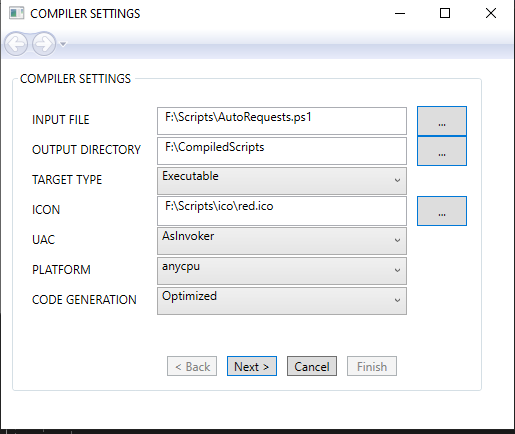
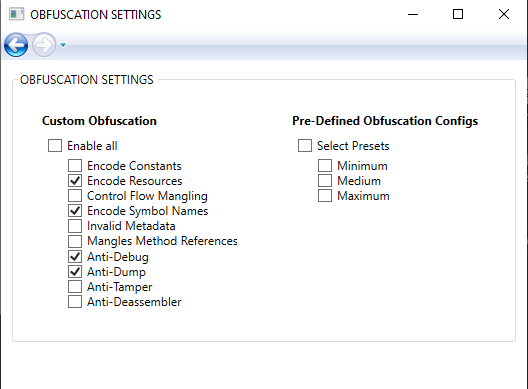
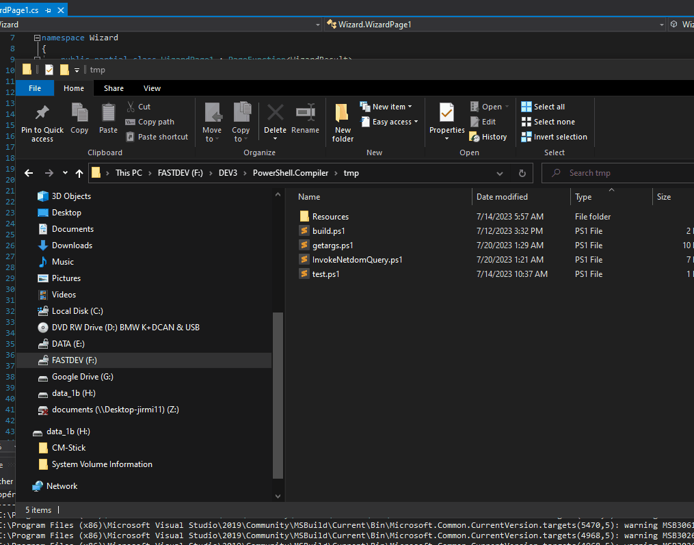

# Overview

I recently had to compile some PowerShell scripts to native portable executable as well as creating binary version of ps modules.
To that end, I implemented my own compiler. Some solutions already exists in the wild to do this, but they are either buggy, old or incomplete.

PS2EXE uses static cs source files and slip a base64 version of your script in before building. Compiled assemblies are easy to id, and a lot of kiddies used the tool to wrap malicious code, so PS2EXE-generated files are very often block by AV software; using ```strings64.exe``` one can retrieve the script in clear. 
PSProtector lacks required features, PowerShell/exe/msi Converter (from SilentInstall) never works and PS to EXE v3 (Fatik Kodak) can't compile modules.

So I implemented my own builder.

## Features

Protect your code and intellectual property.
Convert PS1 script files into portable executables, convert PSM1 files into Windows .NET  libraries (\*.dll)

1. Compile console/gui scripts versions
2. Support resources inclusions / encryption
3. Program password protection
4. Provides assembly packer (compresses exe and uses stub to launch)
5. Obfuscation: from 0 obfuscation (no changes) to aggressive mangling.
6. Obfuscation: selection of 4 predifined presets of customized your protection
 - Advanced Anti-Debug and Anti-Tracer Protection
 - Advanced Overload Renaming
 - Anti-Reflection Protection
 - Anti-Decompiler Protection
 - Control Flow Obfuscation
 - Constant Value/Array Encryption
 - ILDASM Protection
 - String Encryption
 - Symbol Renaming
7. Obfuscation: provided with my own customized version of ***NeoConfuserEx***
8. Suports Cmdline and integration in explorer.

## ScreenShots

Easy to use GUI Interface



Protect your code and intellectual property.
Compile a clear/unencrypted assembly or if required, uses arious obfuscation functionalities to protects your PowerShell script from reverse-engineering/disassembly.



CmdLine support and integration in explorer for quick script compilation without using the GUI

